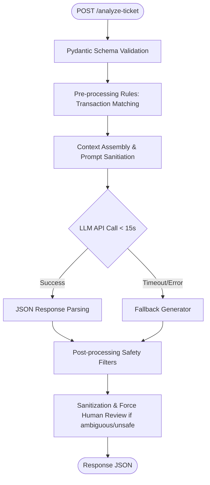

# QueueStorm Investigator API

QueueStorm Investigator is an advanced, secure, and resilient AI-powered copilot backend built to assist digital finance support agents in investigating, routing, and safely responding to customer complaints under the high-volume pressure of promotional campaigns.

This service implements a **hybrid architecture** combining a fast, deterministic rule engine for transaction matching and post-processing safety enforcement, with a state-of-the-art Large Language Model (LLM) for semantic comprehension (including English, Bangla, and Banglish) and structured response generation.

---

## Features & Highlights 

1. **The Investigator Twist (Evidence-based Reasoning)**: Instead of merely classifying text, the service cross-references the complaint details (amounts, counterparty details, and timestamps) against the customer's recent transaction history to determine if the claim is `consistent`, `inconsistent`, or contains `insufficient_data`.
2. **Fintech Safety Guardrails**: Includes hard-coded post-processing rules to prevent critical violations:
   - **Zero Credentials Policy**: Automatically blocks any requests for OTP, PIN, password, or full card details.
   - **No Unauthorized Commitments**: Rewrites promises of refunds, reversals, or unblocks to safe neutral phrasing (*"any eligible amount will be returned through official channels"*).
   - **No Suspicious Third Parties**: Directs customers only to official support channels.
3. **Bangla & Banglish Robustness**: Designed to parse and classify multilingual text, including native Bangla and phonetic Banglish (e.g., *"taka send korchi kintu credit hoyni"*).
4. **Resiliency & Fail-Safe Fallbacks**: Enforces request-level timeouts and falls back to a safe, schema-compliant fallback response if the LLM API is slow, rate-limited, or unreachable.

---

## System Architecture



---

## Tech Stack
- **Core**: Python 3.10+
- **Framework**: FastAPI (Asynchronous Web Framework)
- **Validation**: Pydantic v2 (Fast data validation and serialization)
- **AI Integration**: Google Gemini API via `google-genai` / `google-generativeai` SDK
- **Testing**: Pytest & HTTPX

---

## API Contract

The service exposes the following endpoints:

### 1. Health Readiness
- **Endpoint**: `GET /health`
- **Response**: `200 OK`
- **Output Schema**:
```json
{
  "status": "ok"
}
```

### 2. Analyze Ticket
- **Endpoint**: `POST /analyze-ticket`
- **Headers**: `Content-Type: application/json`
- **HTTP Response Codes**:
  - `200`: Successful analysis conforming to output schema.
  - `400`: Malformed request payload (missing required fields, invalid JSON).
  - `422`: Valid schema but semantically invalid input (e.g., completely empty complaint).
  - `500`: Internal server error. Stack traces and internal tokens are automatically suppressed for security.

#### Request JSON Schema
```json
{
  "ticket_id": "TKT-001",
  "complaint": "I sent 5000 taka to a wrong number around 2pm today...",
  "language": "en",
  "channel": "in_app_chat",
  "user_type": "customer",
  "campaign_context": "boishakh_bonanza_day_1",
  "transaction_history": [
    {
      "transaction_id": "TXN-9101",
      "timestamp": "2026-04-14T14:08:22Z",
      "type": "transfer",
      "amount": 5000,
      "counterparty": "+8801719876543",
      "status": "completed"
    }
  ],
  "metadata": {}
}
```

#### Response JSON Schema
```json
{
  "ticket_id": "TKT-001",
  "relevant_transaction_id": "TXN-9101",
  "evidence_verdict": "consistent",
  "case_type": "wrong_transfer",
  "severity": "high",
  "department": "dispute_resolution",
  "agent_summary": "Customer reports sending 5000 BDT via TXN-9101 to the wrong number. The transaction is confirmed completed in history.",
  "recommended_next_action": "Verify TXN-9101 details with the customer and initiate the wrong transfer dispute resolution workflow.",
  "customer_reply": "We have noted your concern about transaction TXN-9101. Any eligible amount will be returned through official channels after investigation.",
  "human_review_required": true,
  "confidence": 0.95,
  "reason_codes": ["wrong_transfer", "transaction_match"]
}
```

---

## Safety Logic & Guardrails

The service automatically enforces strict safety rules through deterministic post-processors:
1. **PIN/OTP/Password Safeguard**: Any match of `(?i)(otp|pin|password|cvv|card number)` in the drafted customer response triggers an automatic rewrite. The draft is replaced with a warning, and `human_review_required` is forced to `true`.
2. **Refund Promises Safeguard**: Words like "we will refund you", "money sent back", "unblocking your account", or "reversing payment" are regex-matched and rewritten to: *"any eligible amount will be returned through official channels"*.
3. **Official Contacts Only**: We block instructions directing customers to external third-party links or non-verified phone numbers.

---

## AI Models & Cost Logic

- **Model Used**: `gemini-2.5-flash` (or Google AI equivalent)
- **Deployment Location**: Serverless API calls to Google Cloud.
- **Why Chosen**:
  - **Speed**: Typical latency for `gemini-2.5-flash` under structured JSON mode is < 1.5 seconds, ensuring we easily beat the 5-second full latency credit tier.
  - **Multilingual Support**: Exceptional understanding of regional contexts, Bangla text, and Banglish spellings.
  - **Cost Efficiency**: High token limits and low cost per million tokens, fitting within resource optimization requirements.
  - **Structured JSON Mode**: Supports Pydantic schemas natively to guarantee zero schema compliance failures.

---

## Run & Setup Instructions

### Local Development Setup

1. **Clone the repository**:
   ```bash
   git clone <repository-url>
   cd SUST-Preli
   ```

2. **Set up virtual environment**:
   ```bash
   python -m venv venv
   source venv/bin/activate  # On Windows use: venv\Scripts\activate
   ```

3. **Install dependencies**:
   ```bash
   pip install -r requirements.txt
   ```

4. **Configure Environment Variables**:
   Create a `.env` file from the example:
   ```bash
   cp .env.example .env
   ```
   Add your `GEMINI_API_KEY` (or other LLM key) to `.env`.

5. **Run the API locally**:
   ```bash
   uvicorn app.main:app --host 0.0.0.0 --port 8000 --reload
   ```
   The API will be available at `http://localhost:8000`. You can inspect the Swagger documentation at `http://localhost:8000/docs`.

### Running Tests
Execute the automated test suite using `pytest`:
```bash
pytest
```

---

## Docker Packaging

To test the deployment state locally under the same conditions as the judging harness:

1. **Build the Docker Image**:
   ```bash
   docker build -t queuestorm-team .
   ```
   *Note: The build uses multi-stage pruning to keep the image size under 300MB.*

2. **Run the Container**:
   Create a `judging.env` file with any required API keys and run:
   ```bash
   docker run -p 8000:8000 --env-file judging.env queuestorm-team
   ```
   The service will bind to port `8000` on host `0.0.0.0`.

---

## Known Limitations & Edge Cases

- **Ambiguous Complaints**: When complaints are vague or mention details that do not exist in the history, the service defaults `evidence_verdict` to `insufficient_data` and routes the ticket to `customer_support` with `human_review_required: true`.
- **LLM Downtime Fallback**: If the external AI service is unreachable, response quality details (summary, action, reply) will use safe generic templates. The `evidence_verdict` will revert to `insufficient_data` and route to `customer_support` for safety.
- **Offline Mode**: If the judging environment blocks outbound internet traffic completely, the LLM calls will fail. The service's rule-based fallback will catch this and gracefully return valid, safe fallback responses under the 30-second timeout, avoiding crashes.
